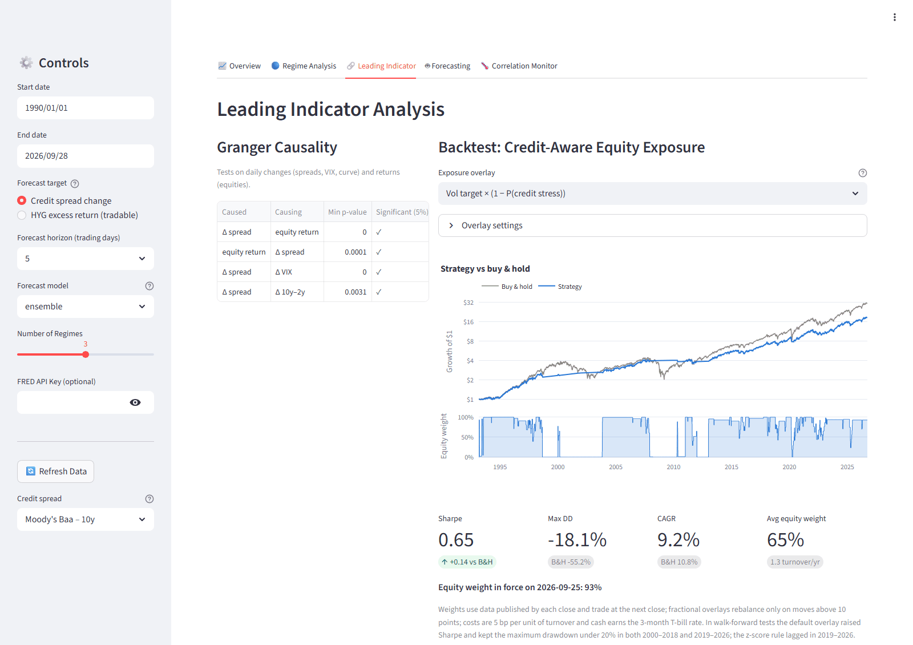
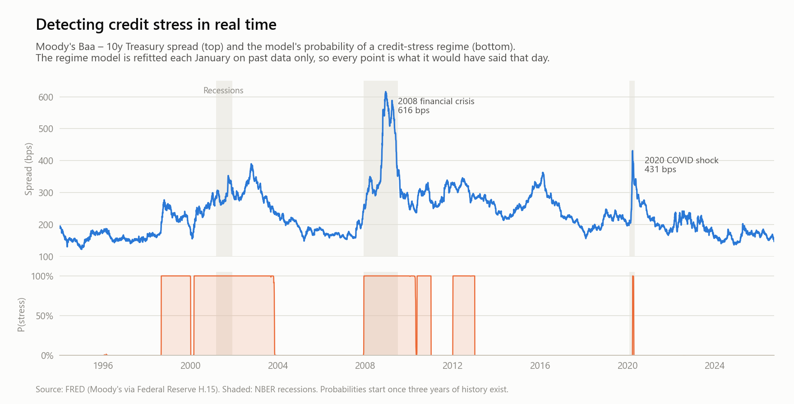
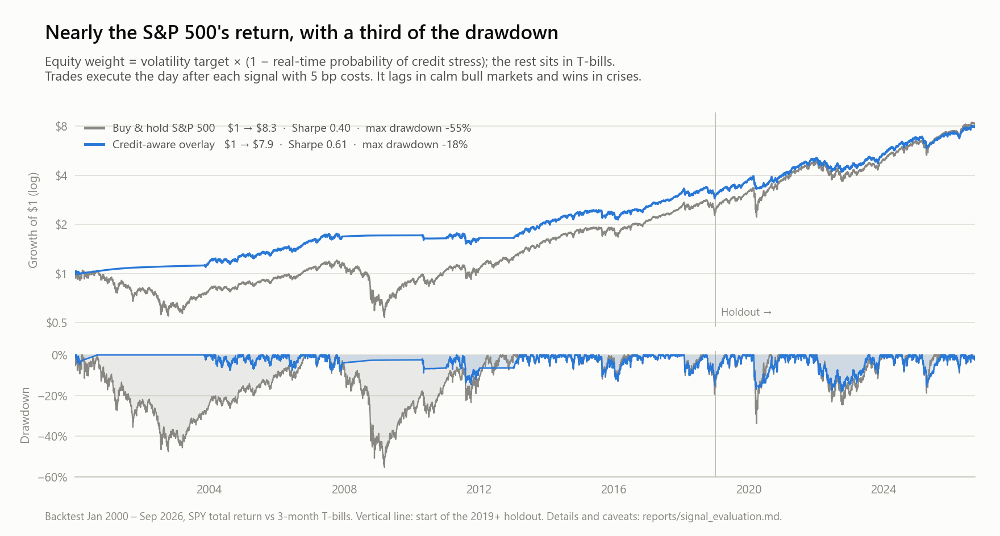
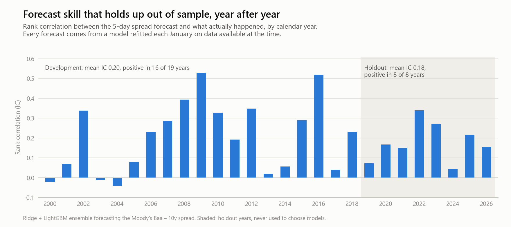
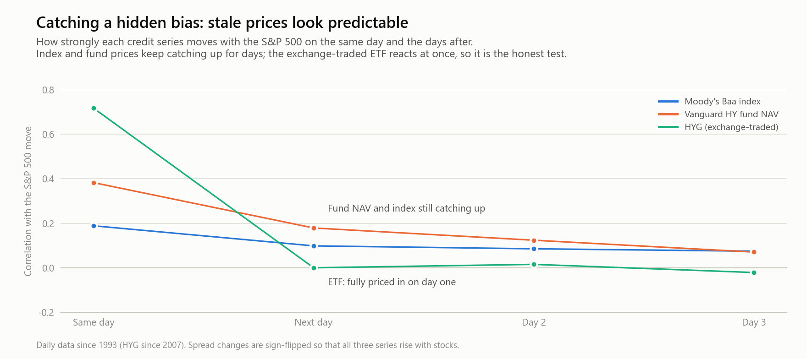
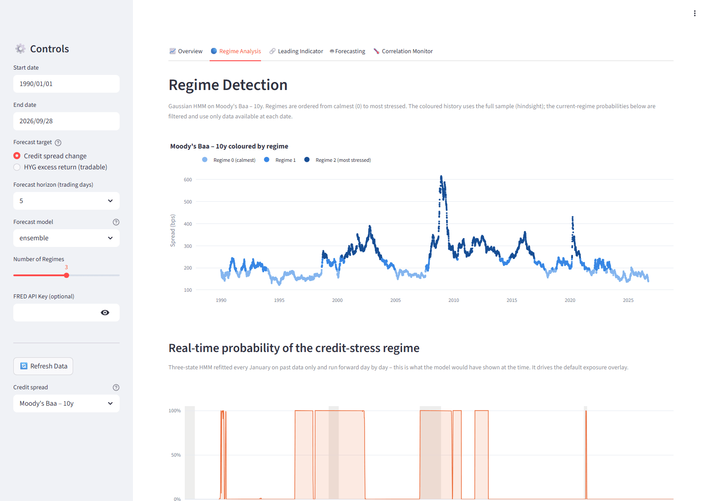
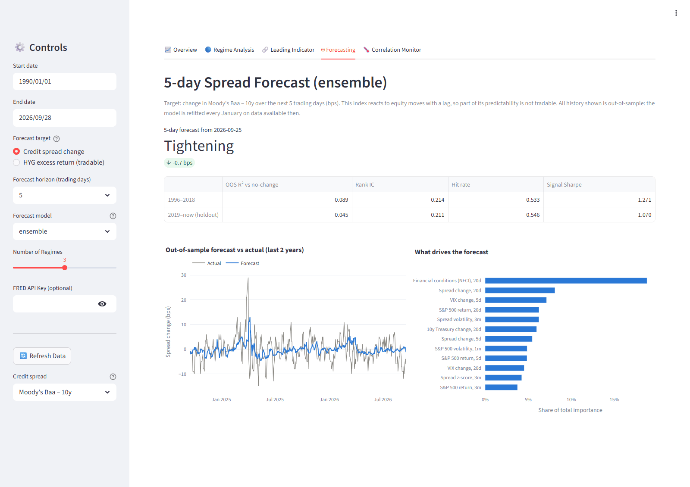

<div align="center">

# Credit Spread Analyzer

**Real-time credit-stress detection, spread forecasting and a drawdown-cutting equity overlay —<br>
validated walk-forward, without look-ahead, on 36 years of market data.**

[](https://github.com/AndrewFSee/credit-spread-analyzer/actions/workflows/tests.yml)
[](https://www.python.org/)
[](#the-dashboard)
[](#what-this-project-demonstrates)
[](#what-this-project-demonstrates)
[](LICENSE)

Built by **Andrew See** · [GitHub](https://github.com/AndrewFSee) · [LinkedIn](https://www.linkedin.com/in/andrewfsee/)

</div>

<picture>
  <source media="(prefers-color-scheme: dark)" srcset="docs/images/dashboard-leading-indicator-dark.png">
  
</picture>

## At a glance

- **Cut the worst drawdown from −55% to −18%.** A credit-aware equity overlay turned $1 into $7.90 from 2000 to 2026, against $8.30 for the S&P 500, with a Sharpe ratio of 0.61 versus 0.40.
- **Forecast skill that survives a holdout.** The 5-day credit-spread forecast ranked outcomes correctly in 24 of 27 years, including all 8 holdout years (2019–2026) that were never used to choose models.
- **Bias caught, not hidden.** Validation showed that part of the apparent edge came from stale index prices, so tradable claims are tested on an exchange-traded fund instead.
- **Built like production code.** The pipeline is point-in-time, with 91 automated tests (including look-ahead regression tests), command-line tools, a reproducible evaluation report and an interactive dashboard.

## What this project demonstrates

| Area | In this project |
|---|---|
| **Quantitative research** | Walk-forward validation with yearly refits, purged labels and an untouched holdout; lead–lag and stationarity analysis; negative results reported rather than dropped |
| **Machine learning** | Ridge, XGBoost, LightGBM, random forests, a sign-constrained factor model and ensembles; LSTM and Transformer benchmarks; SHAP explanations |
| **Time series and regimes** | Hidden Markov models refitted yearly and filtered causally; VAR, impulse responses, Granger causality and cointegration |
| **Data engineering** | One point-in-time pipeline across FRED, the Federal Reserve and Yahoo Finance: publication-date alignment, a versioned cache and optional licensed-data splicing |
| **Software engineering** | Modular Python package, 91 tests, CLI tools, and scripts that regenerate every figure and table |
| **Communication** | A five-tab Streamlit dashboard, figures that render in light and dark mode, and written limits and caveats |

## Results

### 1 · Stress detection

<picture>
  <source media="(prefers-color-scheme: dark)" srcset="docs/images/stress-monitor-dark.png">
  
</picture>

A hidden Markov model, refitted each January on past data only, estimates the probability that credit markets are in a stress regime. It switched on in August 1998, early 2000 and December 2007, the month the Great Recession began. It was late for COVID: it only switched on 23 March 2020, the day the sell-off bottomed. Sudden shocks are therefore handled mainly by the volatility part of the overlay below.

### 2 · Risk overlay

<picture>
  <source media="(prefers-color-scheme: dark)" srcset="docs/images/exposure-overlay-dark.png">
  
</picture>

The overlay holds `min(1, 15% ÷ recent volatility) × (1 − P(credit stress))` in the S&P 500 and the rest in T-bills. It trades the day after each signal and pays transaction costs. **The benefit is risk, not return.** Since 2000 it nearly matched the index with a third of the drawdown. Measured from 1993 instead, it finishes well behind ($18.60 vs $30.90; CAGR 9.1% vs 10.8%), because it holds back in long bull markets. The maximum drawdown is still −18% versus −55%, and the Sharpe ratio 0.65 versus 0.51.

### 3 · Forecast skill

<picture>
  <source media="(prefers-color-scheme: dark)" srcset="docs/images/forecast-skill-dark.png">
  
</picture>

A ridge + LightGBM ensemble forecasts the change in the Moody's Baa spread over the next five trading days. Every point is out of sample. The forecast gets the *direction and ranking* right far more often than chance. The *size* of moves is only modestly predictable (out-of-sample R² of 4–11%).

### 4 · Research integrity

<picture>
  <source media="(prefers-color-scheme: dark)" srcset="docs/images/stale-pricing-dark.png">
  
</picture>

Moody's index yields and mutual-fund prices keep catching up to stock-market moves for days. That makes them look predictable, but nobody can trade on it. HYG, an exchange-traded high-yield fund, absorbs the news the same day. A model trained directly on HYG still ranks the next week's high-yield excess return correctly in every year since 2011 (rank IC 0.13–0.16). That edge is smaller, but it's real.

## The dashboard

<table>
  <tr>
    <td width="50%">
      <picture>
        <source media="(prefers-color-scheme: dark)" srcset="docs/images/dashboard-regime-analysis-dark.png">
        
      </picture>
      <p align="center"><b>Regime analysis:</b> historical regimes and the real-time stress probability</p>
    </td>
    <td width="50%">
      <picture>
        <source media="(prefers-color-scheme: dark)" srcset="docs/images/dashboard-forecasting-dark.png">
        
      </picture>
      <p align="center"><b>Forecasting:</b> live forecast, out-of-sample record and what drives it</p>
    </td>
  </tr>
</table>

Five tabs: market overview, regime analysis, leading indicator and overlay backtest, forecasting (credit spread or tradable HYG), and a correlation monitor.

## Quick start

```bash
git clone https://github.com/AndrewFSee/credit-spread-analyzer.git
cd credit-spread-analyzer
pip install -r requirements.txt

python scripts/run_dashboard.py   # downloads public data on first run; no API key needed
python -m pytest                  # 91 tests on synthetic data, no network needed
```

---

## Technical documentation

### Data

> FRED now serves only about the last three years of the ICE BofA OAS series (high yield, investment grade, BBB). The platform therefore uses:
>
> - **Moody's Baa – 10-year Treasury spread** (`BAA10Y`, daily since 1986) as the primary credit spread.
> - **Public high-yield proxies:**
>   - HYG vs IEI excess returns (2007+, exchange-traded).
>   - A Vanguard high-yield fund vs a Vanguard Treasury fund (1991+).
>   - The Fed's Gilchrist–Zakrajšek spread (monthly).
> - **Your own licensed history, if you have one.** Save an ICE or Bloomberg series as `data/external/hy_spread.csv` (columns: date, value, in percent or bps), then re-download with `--force`.
>   - It is spliced behind the FRED data, and FRED wins where both exist. The splice logs the median difference, so a mismatched source is obvious.
>   - `data/external/` is git-ignored. FRED distributes ICE BofA data under terms that don't allow redistribution, so check your licence before using a third-party copy.
>   - Once a spread has at least `MIN_SPREAD_HISTORY` observations, it becomes selectable everywhere (`--spread-col`, the dashboard sidebar), and the tradable HY model uses it automatically.
>
> All spreads are stored in **basis points**.

<details>
<summary><b>Architecture</b></summary>

```
┌─────────────────────────────────────────────────────────┐
│                    Data Sources                         │
│  FRED (spreads, rates, macro) · Fed GZ spread (CSV)     │
│  Yahoo (equities, VIX, HYG/IEI, HY & Treasury funds)    │
│  optional: data/external/<spread>.csv (licensed)        │
└──────────────────────┬──────────────────────────────────┘
                       │
                       ▼
┌─────────────────────────────────────────────────────────┐
│               src/data/fetcher.py                       │
│  fetch → splice → release-date alignment → trading days │
│   → hedged HY excess returns → versioned Parquet cache  │
└──────────────────────┬──────────────────────────────────┘
                       │
                       ▼
┌─────────────────────────────────────────────────────────┐
│            src/features/engineering.py                  │
│  Publication lags │ Changes │ Z-scores │ HY momentum    │
│  Spread-change / lagged excess-return targets           │
└──────────────────────┬──────────────────────────────────┘
                       │
          ┌────────────┼────────────┐
          ▼            ▼            ▼
┌────────────┐  ┌─────────────┐  ┌──────────────────────┐
│ Regimes    │  │ Statistical │  │ ML / DL Models       │
│ HMM / GMM  │  │ VAR │ IRF   │  │ Composite │ Ridge    │
│ walk-fwd   │  │ Granger     │  │ XGB │ LGBM │ RF      │
│ filtering  │  │ ADF         │  │ Ensemble │ LSTM      │
└─────┬──────┘  └──────┬──────┘  └──────────┬───────────┘
      │                │                     │
      └────────────────┴─────────────────────┘
                       │
                       ▼
┌─────────────────────────────────────────────────────────┐
│  src/models/ml_models.py (purged walk-forward CV)       │
│  src/analysis/leading_indicator.py (exposure overlays)  │
└──────────────────────┬──────────────────────────────────┘
                       │
                       ▼
┌─────────────────────────────────────────────────────────┐
│   src/visualization/plots.py  │  src/dashboard/app.py   │
│   Plotly / Matplotlib charts  │  Streamlit dashboard    │
└─────────────────────────────────────────────────────────┘
```

</details>

<details>
<summary><b>Features</b></summary>

- **Data ingestion:**
  - FRED (API key optional; falls back to the public CSV endpoint).
  - The Fed's Gilchrist–Zakrajšek spread and excess bond premium.
  - Yahoo Finance: equities, VIX/MOVE, HYG/IEI, and high-yield / Treasury mutual funds.
  - An optional import of licensed spread histories, spliced behind FRED's recent data.
- **Look-ahead-free alignment:**
  - Monthly and weekly releases are re-dated to their publication dates.
  - Daily FRED series carry a one-day publication lag.
  - Data sits on the equity trading calendar.
  - The Parquet cache is versioned, so old caches are rebuilt when the columns change.
- **Stationary features:** spread changes, z-scores and volatility; equity momentum and drawdown; VIX and rate changes; financial conditions; HY excess-return momentum and volatility; GZ-spread changes.
- **Forecast targets:**
  - The Baa spread change (bps).
  - The tradable HYG − 0.85 × IEI excess return, entered the day after the signal.
- **Forecasting models:**
  - A sign-constrained composite factor model.
  - Ridge regression.
  - XGBoost, LightGBM and Random Forest (volatility-scaled targets).
  - A ridge + LightGBM ensemble.
  - LSTM and Transformer models.
- **Purged validation:**
  - Walk-forward evaluation with yearly refits.
  - Labels are purged by the horizon plus the execution lag.
  - An untouched holdout period (2019 onward).
- **Regime detection:**
  - HMM with random restarts, plus GMM, ordered from calmest to most stressed.
  - **Real-time regime probabilities:** the HMM is refitted yearly on past data only and forward-filtered.
- **Equity exposure overlays:** volatility targeting × (1 − P(credit stress)) by default; single-factor and all-or-nothing variants are available.
  - Trades execute on the next day and are only made when the target weight moves more than 10 points.
  - Costs are charged; cash earns the T-bill rate.
- **Interactive dashboard:** a 5-tab Streamlit app (Overview, Regimes, Leading Indicator, Forecasting, Correlations).
- **CLI scripts:** `download_data.py`, `train_models.py`, `evaluate_signals.py`, `make_readme_figures.py` and `run_dashboard.py`.

</details>

### Setup

```bash
# 1. Clone the repository
git clone https://github.com/AndrewFSee/credit-spread-analyzer.git
cd credit-spread-analyzer

# 2. Create and activate a virtual environment
python -m venv .venv
source .venv/bin/activate          # Windows: .venv\Scripts\activate

# 3. Install dependencies
pip install -r requirements.txt

# 4. (Optional) install the package in development mode
pip install -e .

# 5. (Optional) set a FRED API key – without one, the public CSV endpoint is used
export FRED_API_KEY="your_api_key_here"

# 6. (Optional) add licensed spread histories, e.g. data/external/hy_spread.csv
```

### Usage

#### Download data

```bash
python scripts/download_data.py --start-date 1990-01-01 --output-dir data/
# add --force to rebuild the cache (e.g. after adding files to data/external/)
```

#### Evaluate all models and signals (walk-forward + holdout)

```bash
python scripts/evaluate_signals.py \
    --data-path data/market_data_1990-01-01_<end-date>.parquet \
    --with-dl
# → reports/signal_evaluation.md
```

#### Train a model and get the latest forecast

```bash
# Baa spread change, 5 days (recommended model: ensemble)
python scripts/train_models.py --data-path data/market_data_1990-01-01_<end-date>.parquet

# ICE high-yield OAS change, if a long history has been spliced in
python scripts/train_models.py --data-path data/... --spread-col hy_spread

# Tradable HYG excess return, 5 days
python scripts/train_models.py --data-path data/market_data_1990-01-01_<end-date>.parquet --target hyg

# options: --model-type {composite,ridge,ensemble,xgboost,lightgbm,random_forest}
#          --target-horizon N  --task {regression,classification}  --output-dir models/saved/
```

#### Exposure overlay in code

```python
from src.analysis.leading_indicator import run_full_backtest

bt, metrics = run_full_backtest(df)                    # vol target × (1 − P(stress))
bt, metrics = run_full_backtest(df, method="zscore")   # all-or-nothing alternative
bt["weight"].iloc[-1]                                   # equity weight currently in force
```

#### Launch the Streamlit dashboard

```bash
python scripts/run_dashboard.py
# or directly:
python -m streamlit run src/dashboard/app.py
```

Use `python -m streamlit` rather than a bare `streamlit`. With `pip install --user`, the `streamlit` executable goes into a Scripts folder that is often not on PATH (on Windows, `%APPDATA%\Python\Python3XX\Scripts`), so the bare command fails with "not recognized".

#### Regenerate the README figures

```bash
python scripts/make_readme_figures.py --data-path data/market_data_1990-01-01_<end-date>.parquet
# → docs/images/*-light.png and *-dark.png (public data only)
```

### Signal validation

Full tables are in [`reports/signal_evaluation.md`](reports/signal_evaluation.md), generated by `scripts/evaluate_signals.py`.

**Setup:**

- **Refits:** models are refitted every January on data whose labels were fully known.
- **Development period:** 2000–2018 (2011–2018 for HYG), used for choices.
- **Holdout:** 2019-01 to 2026-09.

#### 1. Baa spread forecasts

| Horizon | Model | Period | OOS R² | Rank IC | Hit rate | Years with IC > 0 |
|---|---|---|---|---|---|---|
| 5 days | ensemble (recommended) | 2000–2018 | 0.114 | 0.261 | 54.5% | 16/19 |
| 5 days | ensemble (recommended) | holdout | 0.045 | 0.215 | 54.9% | 8/8 |
| 5 days | composite | holdout | 0.068 | 0.159 | 53.4% | 8/8 |
| 20 days | composite (recommended) | 2000–2018 | 0.115 | 0.275 | 58.0% | 13/19 |
| 20 days | composite (recommended) | holdout | 0.001 | 0.131 | 53.9% | 5/8 |

- **5 days:** every model beat a no-change forecast in both periods.
- **20 days:** forecasts get the direction right more often than not, but the size of the move has no skill (ridge, trees and ensemble all had negative holdout R²).
- **Is the Baa proxy a good stand-in for high yield?** Partly:
  - **It tracks the direction of high-yield stress well.** Baa changes correlate with ICE HY changes at 0.61 daily, 0.74 over 20 days and 0.86 over 60 days (0.86–0.87 against the long proxies back to 1991).
  - **It does not capture magnitudes or levels.** High yield moves about 2.2 bps per 1 bp of Baa, Baa explains only about half the variance of HY moves at 5–20 days, and average levels differ (164 vs 312 bps over 2023–2026).
  - **So:** use it for regimes and stress detection, not for HY levels or position sizing.
- **Deep learning:**
  - The LSTM is comparable to the ensemble at 5 days (holdout R² 0.04–0.10 across seeds) but less stable.
  - The Transformer is unreliable: holdout R² ranged from −0.38 to +0.10 across seeds.

#### 2. How much of that is tradable?

**Moody's Baa yields and bond-fund NAVs react to equity moves with a delay.** The table shows the correlation of each series' move on day *t+k* with the SPY return on day *t*.

| Series | k=0 | k=1 | k=2 |
|---|---|---|---|
| Δ Baa – 10y | −0.19 | −0.10 | −0.09 |
| Δ ICE HY OAS (2023+) | −0.62 | −0.15 | 0.00 |
| Vanguard HY fund excess return | 0.38 | 0.18 | 0.12 |
| HYG excess return | 0.72 | **0.00** | 0.02 |

- **Part of the Baa forecast skill reflects slow index updating.**
  - It still carries over to the market-based ICE spreads (rank IC 0.10 for HY, 0.20 for BBB and 0.17 for IG, over 2023–2026).
  - It barely carries over to HYG (IC 0.04–0.07).
- **Use it as a forecast of reported spreads, not as a trading signal.**

#### 3. Tradable high yield (HYG − 0.85 × IEI, 5 days, next-day entry)

| Model | Period | OOS R² | Rank IC | Hit rate | Years with IC > 0 |
|---|---|---|---|---|---|
| ensemble (recommended) | 2011–2018 | 0.007 | 0.127 | 52.8% | 8/8 |
| ensemble (recommended) | holdout | −0.018 | 0.164 | 56.1% | 8/8 |
| composite (Baa priors, reversed) | holdout | −0.002 | −0.059 | 51.0% | 2/8 |

- **Weak but consistent.** The ensemble ranks the next week's HY excess return correctly in every year, but the size of the move is not predictable.
- **The Baa-style priors fail here.** For HYG, an equity sell-off is followed by a small rebound, not further losses.
- **Proxy caveat.** Models trained on the long Vanguard fund history look better when tested on the fund itself, because of stale pricing. They transfer poorly to HYG, so HYG is the evaluation target.

#### 4. Regime-conditional forecasts: no improvement

Adding real-time HMM regime probabilities as features left the recommended models essentially unchanged:

- **Baa 5-day holdout:** R² 0.059 → 0.056, IC 0.220 → 0.227.
- **HYG holdout:** IC 0.164 → 0.161.
- **Ridge with regime interaction terms:** it overfit.

The option remains (`build_feature_matrix(..., regime_probs=...)`), but it is off by default.

#### 5. Equity exposure overlays

**Default overlay.** Equity weight = `min(1, 15% / recent SPY vol) × (1 − real-time P(credit stress))`, with the rest in T-bills.

| Period | Overlay | CAGR | Sharpe | Max drawdown | Avg equity |
|---|---|---|---|---|---|
| 2000–2018 | **vol × (1 − P(stress))** (default) | 6.0% | 0.51 | −14.9% | 55% |
| 2000–2018 | z-score in/out (previous default) | 7.0% | 0.53 | −23.6% | 60% |
| 2000–2018 | vol target only | 5.1% | 0.32 | −42.2% | 86% |
| 2000–2018 | buy & hold SPY | 4.8% | 0.25 | −55.2% | 100% |
| holdout | **vol × (1 − P(stress))** (default) | 13.4% | 0.82 | −18.1% | 85% |
| holdout | z-score in/out (previous default) | 8.4% | 0.52 | −20.8% | 61% |
| holdout | vol target only | 14.0% | 0.84 | −18.2% | 88% |
| holdout | buy & hold SPY | 17.3% | 0.78 | −33.7% | 100% |

- **Why the combination:** it is the only overlay that both improved Sharpe and kept the maximum drawdown under 20% in both periods.
  - **Volatility targeting alone** matched it on the holdout, but it fell 42% in 2000–2018 (Sharpe −0.30 in 2000–2004).
  - **The z-score and regime rules alone** lagged buy & hold in 2019–2026.
  - **The 50 bp widening rule** is almost always invested, so it barely reduced the 2000–2018 drawdown (−50%).
- **It still trails buy & hold in calm bull markets:** 2010–2014 (Sharpe 0.71 vs 0.98) and 2023–2026 (0.97 vs 1.09). It also gives up return (CAGR) for lower risk.
- **Selection caveat:** the overlays were compared on both periods at the same time. The holdout is therefore not untouched for this particular choice.

#### 6. With a long ICE high-yield history (optional data)

Section 6 of the report re-runs the comparison whenever `hy_spread` has enough history.  With a spliced 1997+ history:

| Use | Result |
|---|---|
| 5-day spread forecast | Both work out of sample. Baa keeps the higher rank IC (0.215 vs 0.155 on the holdout); the HY ensemble has the better hit rate (56.4% vs 54.8%) and was positive in 8/8 holdout years |
| 20-day spread forecast | **Baa only.** HY collapses on the holdout (IC 0.04, 3/8 years) |
| Tradable HYG model features | **HY wins in both periods** (holdout IC 0.177 vs 0.163, R² +0.024 vs −0.018). This is now the default when the history exists |
| Exposure overlay | Comparable: HY-driven regimes were better in 2001–2018 (Sharpe 0.67 vs 0.53), Baa better on the holdout (0.82 vs 0.76). Baa stays the default because it needs no licensed data |

The Baa spread remains `PRIMARY_SPREAD`, so the project behaves identically for anyone without licensed data.

### Methodology: avoiding look-ahead bias

| Issue | Handling |
|---|---|
| Data publication delays | Monthly and weekly macro series (and the GZ spread) are re-dated by `RELEASE_LAG_DAYS`. Daily FRED series are shifted by one row in features and signals. |
| Weekends and holidays | Data is aligned to the equity trading calendar. Returns are never forward-filled. |
| Overlapping labels | Training windows end *h* (+ execution lag) rows before each test period. |
| Execution | Positions change at the close *after* the signal date. Tradable targets start one day after the signal. |
| Stale pricing | Lead–lag correlations are reported. Tradable claims are tested on HYG, not on indices or fund NAVs. |
| Scaling in deep learning | Scalers are fit on training rows only. Early stopping uses a validation slice that precedes the holdout. |
| Regimes | Signals and features use `real_time_regime_probabilities` (yearly refits, forward filter). `label_regimes` is descriptive only. |
| Model selection | Choices were made on the development period. The exposure overlay is the exception noted above. |

<details>
<summary><b>Module descriptions</b></summary>

| Module | Description |
|--------|-------------|
| `config/settings.py` | Central configuration: series, release lags, HY proxies, model / overlay defaults, holdout date |
| `src/data/fetcher.py` | FRED / Fed CSV / Yahoo fetching, licensed-history splicing, trading-day alignment, HY excess returns, cache |
| `src/features/engineering.py` | Stationary features, HY features, regime features, publication lags, targets |
| `src/models/regime.py` | HMM (restarts) and GMM regimes, filtered and walk-forward probabilities |
| `src/models/statistical.py` | Granger causality, VAR, IRF, FEVD, ADF, Johansen cointegration |
| `src/models/ml_models.py` | Composite / ridge / tree / ensemble models, purged CV, walk-forward, metrics, SHAP |
| `src/models/dl_models.py` | LSTM and Transformer with leak-free scaling and early stopping |
| `src/analysis/leading_indicator.py` | Exposure weights (vol × regime, z-score, widening) and allocation backtests |
| `src/visualization/plots.py` | Plotly / Matplotlib charts with a colour-vision-safe palette and readable labels |
| `src/dashboard/app.py` | 5-tab Streamlit dashboard |
| `scripts/download_data.py` | CLI: fetch and cache market data |
| `scripts/train_models.py` | CLI: train a Baa or HYG model, report CV + holdout metrics, latest forecast |
| `scripts/evaluate_signals.py` | CLI: full walk-forward evaluation → `reports/signal_evaluation.md` |
| `scripts/make_readme_figures.py` | CLI: render the README figures (light and dark) from the project's own models |
| `scripts/run_dashboard.py` | CLI: launch Streamlit dashboard |

</details>

<details>
<summary><b>Data sources</b></summary>

| Source | Series / Ticker | Description |
|--------|----------------|-------------|
| [FRED](https://fred.stlouisfed.org) | `BAA10Y` | Moody's Seasoned Baa Corporate Bond Yield minus 10-Year Treasury (primary spread) |
| FRED | `AAA10Y` | Moody's Seasoned Aaa Corporate Bond Yield minus 10-Year Treasury |
| FRED | `BAMLH0A0HYM2`, `BAMLC0A0CM`, `BAMLC0A4CBBB` | ICE BofA HY / IG / BBB OAS (last ~3 years only) |
| FRED | `T10Y2Y`, `T10Y3M`, `DGS10`, `DGS3MO`, `DFF` | Treasury curve, yields and Fed Funds |
| FRED | `DTWEXBGS`, `NFCI`, `ICSA`, `CPIAUCSL`, `UNRATE` | Dollar, financial conditions, claims, CPI, unemployment |
| [Federal Reserve](https://www.federalreserve.gov/econres/notes/feds-notes/updating-the-recession-risk-and-the-excess-bond-premium-20161006.html) | `ebp_csv.csv` | Gilchrist–Zakrajšek spread and excess bond premium (monthly) |
| [Yahoo Finance](https://finance.yahoo.com) | `^GSPC`, `SPY` | S&P 500 index and total-return ETF |
| Yahoo Finance | `^VIX`, `^MOVE` | Equity and bond implied volatility |
| Yahoo Finance | `HYG`, `IEI`, `IEF` | High-yield ETF and Treasury ETFs (2007+ / 2007+ / 2002+) |
| Yahoo Finance | `VWEHX`, `VFITX` | Vanguard High-Yield Corporate and Intermediate-Term Treasury funds |
| Yahoo Finance | `CL=F`, `GC=F` | Crude oil and gold futures |

</details>

<details>
<summary><b>Configuration</b></summary>

All parameters are in `config/settings.py`:

```python
FRED_API_KEY               # Optional; set via FRED_API_KEY env var
DEFAULT_START_DATE         # "1990-01-01"
FRED_SERIES / YAHOO_TICKERS / EXTERNAL_CSV_SERIES
SPREAD_COLUMNS             # converted from percent to bps
SPREAD_HISTORY_DIR         # data/external – optional licensed histories
RELEASE_LAG_DAYS           # publication delays for low-frequency series
FRED_DAILY_PUBLICATION_LAG # 1 row
HY_EXCESS_RETURN_PAIRS     # hedged HY proxies and hedge ratios
PRIMARY_SPREAD             # "baa_spread"
MIN_SPREAD_HISTORY         # 1500 rows before a spread is usable for modelling
HY_FEATURE_SPREAD_PREFERENCE  # ("hy_spread", "baa_spread")
TARGET_HORIZON             # 5 trading days
HOLDOUT_START              # "2019-01-01"
MODEL_PARAMS               # xgboost / lightgbm / random_forest (shallow, regularised)
RECOMMENDED_MODEL          # {5: "ensemble", 20: "composite"}
RECOMMENDED_MODEL_HY       # "ensemble"
EXPOSURE_METHOD            # "vol_regime"
EXPOSURE_TARGET_VOL        # 0.15
HMM_N_STATES               # 3
DATA_DIR / MODELS_DIR
```

</details>

### Testing

```bash
python -m pytest                      # all tests (synthetic data, no network) – also run by GitHub Actions on every push
python -m pytest tests/test_features.py -v
python -m pytest --cov=src --cov-report=term-missing
```

The tests include regression checks for:

- Look-ahead bias in features and in walk-forward regime probabilities.
- Publication and release lags.
- Purged walk-forward windows.
- Execution timing, rebalancing bands and costs.
- Spread units, licensed-history splicing and history-aware spread selection.
- Cache versioning.
- Regime ordering.
- Deep-learning label alignment and scaling.

### Notebooks

| Notebook | Topic |
|----------|-------|
| `01_data_exploration.ipynb` | Data coverage, statistics, spread history, correlations, HY proxies |
| `02_regime_detection.ipynb` | HMM / GMM regimes, real-time stress probability, exposure overlays |
| `03_granger_causality.ipynb` | Stationarity, Granger tests, VAR / IRF / FEVD, Johansen, stale-pricing check |
| `04_ml_forecasting.ipynb` | Walk-forward comparison of all models, SHAP, tradable HYG model |
| `05_deep_learning.ipynb` | LSTM and Transformer trained before, evaluated on, the holdout |

### Future improvements

- **Licensed high-yield history:** drop a full ICE HY OAS history into `data/external/` and compare it with the public proxies.
- **Intraday or ETF-based spread nowcasts:** reduce the stale-pricing gap in daily index data.
- **Probabilistic forecasts:** add quantile models for spread-widening tail risk.
- **Multi-asset overlay:** extend exposure management to a stock / bond / cash mix.
- **Experiment tracking:** add MLflow or W&B.
- **Alerting:** send email or Slack notifications on regime shifts.

## License

MIT – see [LICENSE](LICENSE) for details.
